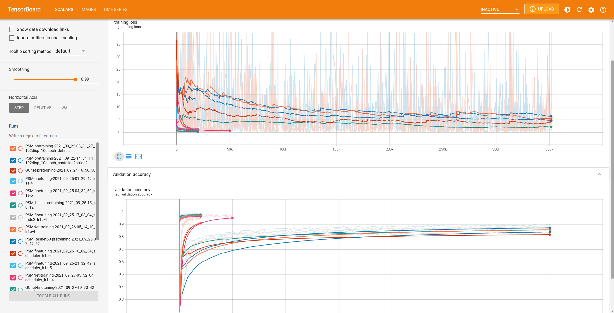
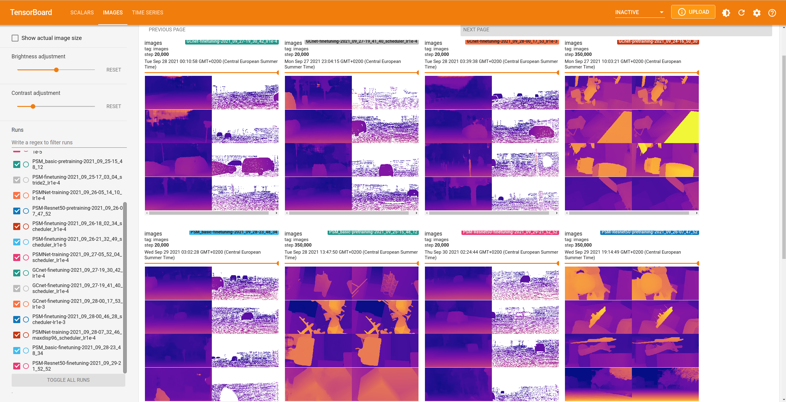

# Cuda Lab Vision - Stereo Depth Estimation

**Table of Contents**

* [labvision_stereo_depth_estimation](#labvision_stereo_depth_estimation)
   * [The Project Notebook and Report](#the-project-notebook-and-report)
   * [Before Starting](#before-starting)
      * [Inspection of .pfm/.pgm Files](#inspection-of-pfmpgm-files)
      * [Solving Problems with Webp/Anaconda](#solving-problems-with-webpanaconda)
      * [Installing Workspace](#installing-workspace)
   * [Running Tensorboard](#running-tensorboard)
   * [Extra](#extra)


**Authors:** 

- Elif Cansu YILDIZ 
- Salih MARANGOZ 

Please view this file with a markdown editor/reader (e.g. [Typora](https://typora.io/)) for a better experience.


## The Project Notebook and Report

- The project notebook can be viewed directly (without Github, only HTML) [here](https://elifcansuyildiz.github.io/StereoDepthEstimation/project_report.html) and all experiments output [here](https://elifcansuyildiz.github.io/StereoDepthEstimation/all_experiments.html).
- The project report (PDF) can be downloaded/viewed [here](https://elifcansuyildiz.github.io/StereoDepthEstimation/Lab_Vision_Report.pdf).


## Before Starting

### Inspection of .pfm/.pgm Files

We added a desktop entry to the run viewer easily. Run these two commands to install the viewer for `.pfm/.pgm` files. Open files with `Open with Other Application` and select `PFS Viewer`.

```bash
$ sudo apt install pfstools pfsview

$ tee $HOME/.local/share/applications/pfs_viewer.desktop << END
[Desktop Entry]
Exec=sh -c "/usr/bin/pfsin %f | /usr/bin/pfsview"
Name=PFS Viewer
Terminal=false
Type=Application
END
```


### Solving Problems with Webp/Anaconda

**NOTE:** We added `venv_for_webp` just in case something changes in the future.

Unfortunately there was a problem with webp and PIL connection. We solved this problem temporarily by installing the package to a virtual environment and appending its modules path to the PATH environment variable. Run these terminal commands to create the virtual environment: 

```bash
# If you want to install the virtual environment by yourself;
# Remove 'venv_for_webp' folder by hand please. We didn't put here rm -rf command because it can be dangerous...
$ pip3 install virtualenv
$ virtualenv venv_for_webp
$ source venv_for_webp/bin/activate
$ pip3 install webp
```

Run in jupyter notebok for testing:

```bash
import os, sys
import numpy as np
local_pip_path = os.path.join(os.getcwd(), "venv_for_webp/lib/python3.8/site-packages")
sys.path.append(local_pip_path)
import webp
test_image = webp.load_image("test.webp", mode="RGB")
print("Test Image Shape:", np.array(test_image).shape)
test_image
```


### Installing Workspace

We added `environment.yml`for Anaconda installation. We had to use PyTorch-Nightly to utilize RTX3090 in the laboratory. Specified PyTorch-Nightly version may not be available so try using version `1.10.0` or `1.9.1`.  

We described where to put dataset folder in `project_report.ipynb`.


## Running Tensorboard

Starting with default settings may show less data. Try with increasing samples:

```bash
$ cd run
$ tensorboard --samples_per_plugin="scalar=10000,images=200" --logdir .
```






## Extra

We also experimented with OpenCV disparity estimation, but the results was of course not good...

Source: https://github.com/aliyasineser/stereoDepth/blob/master/stereo_depth.py

| Input (Left Image) (Right image not showed) | Output (Disparity Map)                 |
| ------------------------------------------- | -------------------------------------- |
|                 |  |

